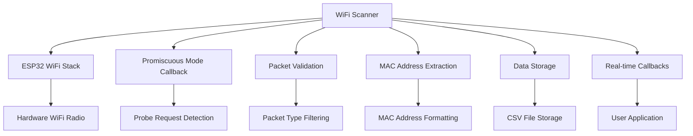

# WiFi Scanner Module Documentation

## Overview

The WiFi Scanner module provides comprehensive WiFi probe request capture functionality for the Forestry Research Device. It operates in promiscuous mode to capture WiFi probe requests from nearby devices, enabling passive monitoring of WiFi-enabled devices in forestry environments.

## Features

- **Promiscuous Mode Scanning**: Captures all WiFi probe requests without connecting to networks
- **Real-time Processing**: Immediate callback-based processing of captured packets
- **Thread-Safe Operations**: Safe for use in multi-threaded applications
- **Platform Abstraction**: Works on ESP32 (production) and development platforms (mock mode)
- **MAC Address Filtering**: Built-in filtering for known broadcast/ignored MAC addresses
- **Comprehensive Logging**: Detailed logging with configurable verbosity levels
- **Data Persistence**: Automatic saving to storage with CSV formatting

## Architecture



## Class Interface

### Constructor
```cpp
WiFiScanner(std::shared_ptr<IDataStorage> storage,
            std::shared_ptr<ITimeManager> timeManager);
```

### Core Methods
```cpp
// Initialization and lifecycle
bool initialize();                          // Initialize WiFi stack and promiscuous mode
bool startScan();                          // Enable promiscuous mode scanning
bool stopScan();                           // Disable promiscuous mode scanning
void cleanup();                            // Clean up resources

// Data access
std::vector<ProbeRequest> getResults();    // Get all captured probe requests
size_t getResultCount() const;             // Get count of captured requests
void clearResults();                       // Clear stored results
bool isScanning() const;                   // Check if currently scanning

// Configuration
void setProbeCallback(std::function<void(const ProbeRequest&)> callback);
```

## Data Structures

### ProbeRequest Structure
```cpp
struct ProbeRequest {
    std::string dataType;        // "Wi-Fi"
    std::string timestamp;       // ISO 8601 timestamp
    std::string source;          // "wifi"
    int rssi;                   // Signal strength in dBm
    int packetLength;           // Total packet length in bytes
    std::string macAddress;     // MAC address (format: "aa:bb:cc:dd:ee:ff")
    std::string payload;        // Hex representation of packet data
};
```

### Example ProbeRequest Data
```cpp
ProbeRequest {
    .dataType = "Wi-Fi",
    .timestamp = "2024-01-15T10:30:45Z",
    .source = "wifi",
    .rssi = -67,
    .packetLength = 64,
    .macAddress = "aa:bb:cc:dd:ee:ff",
    .payload = "40 00 3c 01 ff ff ff ff ff ff aa bb cc dd ee ff ..."
}
```

## Usage Examples

### Basic Usage

```cpp
#include "scanners/wifi_scanner.h"
#include "data/sdcard_manager.h"
#include "data/rtc_time_manager.h"

int main() {
    // Create dependencies
    auto storage = std::make_shared<SDCardManager>();
    auto timeManager = std::make_shared<RTCTimeManager>();
    
    // Initialize dependencies
    storage->initialize();
    timeManager->initialize();
    
    // Create WiFi scanner
    auto wifiScanner = std::make_unique<WiFiScanner>(storage, timeManager);
    
    // Initialize scanner
    if (!wifiScanner->initialize()) {
        LOG_ERROR("Main", "WiFi scanner initialization failed");
        return -1;
    }
    
    // Start scanning
    if (!wifiScanner->startScan()) {
        LOG_ERROR("Main", "Failed to start WiFi scan");
        return -1;
    }
    
    // Scan for 30 seconds
    LOG_INFO("Main", "Scanning for 30 seconds...");
    std::this_thread::sleep_for(std::chrono::seconds(30));
    
    // Stop scanning
    wifiScanner->stopScan();
    
    // Get results
    auto results = wifiScanner->getResults();
    LOG_INFO("Main", "Captured {} probe requests", results.size());
    
    // Process results
    for (const auto& request : results) {
        LOG_INFO("Main", "Device: {} (RSSI: {})", 
                request.macAddress, request.rssi);
    }
    
    return 0;
}
```

### Real-time Processing

```cpp
#include "scanners/wifi_scanner.h"

void setupRealTimeProcessing() {
    auto wifiScanner = std::make_unique<WiFiScanner>(storage, timeManager);
    
    // Set up real-time callback
    wifiScanner->setProbeCallback([](const ProbeRequest& request) {
        // Process probe request immediately
        LOG_INFO("WiFi", "Real-time probe: {} (RSSI: {} dBm)", 
                request.macAddress, request.rssi);
        
        // Check for high-strength signals
        if (request.rssi > -50) {
            LOG_WARNING("WiFi", "Very close device detected: {}", request.macAddress);
            // Trigger immediate action
            handleCloseDevice(request);
        }
        
        // Filter for specific device types
        if (isInterestingDevice(request.macAddress)) {
            LOG_INFO("WiFi", "Target device detected: {}", request.macAddress);
            // Store in special database
            storeTargetDevice(request);
        }
    });
    
    wifiScanner->initialize();
    wifiScanner->startScan();
    
    // Scanner will now call callback for each probe request
    // Continue other processing...
}

bool isInterestingDevice(const std::string& mac) {
    // Check against known device patterns
    return mac.substr(0, 8) == "aa:bb:cc"; // Example filter
}

void handleCloseDevice(const ProbeRequest& request) {
    // Handle devices with very strong signals
    LOG_CRITICAL("WiFi", "Device very close: {} at {} dBm", 
                request.macAddress, request.rssi);
}
```

### Continuous Monitoring

```cpp
#include "scanners/wifi_scanner.h"
#include <atomic>
#include <thread>

class ContinuousWiFiMonitor {
private:
    std::unique_ptr<WiFiScanner> scanner_;
    std::atomic<bool> running_;
    std::thread monitorThread_;
    
public:
    ContinuousWiFiMonitor(std::shared_ptr<IDataStorage> storage,
                         std::shared_ptr<ITimeManager> timeManager) 
        : scanner_(std::make_unique<WiFiScanner>(storage, timeManager))
        , running_(false) {}
    
    bool start() {
        if (!scanner_->initialize()) {
            return false;
        }
        
        running_.store(true);
        monitorThread_ = std::thread(&ContinuousWiFiMonitor::monitorLoop, this);
        
        LOG_INFO("Monitor", "Continuous WiFi monitoring started");
        return true;
    }
    
    void stop() {
        running_.store(false);
        if (monitorThread_.joinable()) {
            monitorThread_.join();
        }
        scanner_->cleanup();
        LOG_INFO("Monitor", "Continuous WiFi monitoring stopped");
    }
    
private:
    void monitorLoop() {
        const auto scanDuration = std::chrono::seconds(30);
        const auto pauseDuration = std::chrono::seconds(5);
        
        while (running_.load()) {
            // Start scan cycle
            LOG_INFO("Monitor", "Starting scan cycle");
            scanner_->clearResults();
            scanner_->startScan();
            
            // Scan for specified duration
            std::this_thread::sleep_for(scanDuration);
            
            // Stop and process results
            scanner_->stopScan();
            auto results = scanner_->getResults();
            
            LOG_INFO("Monitor", "Scan cycle complete: {} devices detected", 
                    results.size());
            
            // Process and analyze results
            processResults(results);
            
            // Pause between scans
            std::this_thread::sleep_for(pauseDuration);
        }
    }
    
    void processResults(const std::vector<ProbeRequest>& results) {
        // Analyze signal strengths
        int strongSignals = 0;
        int weakSignals = 0;
        
        for (const auto& request : results) {
            if (request.rssi > -60) {
                strongSignals++;
            } else if (request.rssi < -80) {
                weakSignals++;
            }
        }
        
        LOG_INFO("Monitor", "Signal analysis: {} strong, {} weak", 
                strongSignals, weakSignals);
        
        // Generate summary report
        generateScanReport(results);
    }
    
    void generateScanReport(const std::vector<ProbeRequest>& results) {
        // Create scan summary
        std::ostringstream report;
        report << "WiFi Scan Report - " << Utils::getCurrentTimestamp() << "\n";
        report << "Total Devices: " << results.size() << "\n";
        
        // Device breakdown by signal strength
        std::map<std::string, int> signalRanges;
        for (const auto& request : results) {
            if (request.rssi > -50) signalRanges["Very Strong (-50 to 0)"]++;
            else if (request.rssi > -70) signalRanges["Strong (-70 to -50)"]++;
            else if (request.rssi > -85) signalRanges["Moderate (-85 to -70)"]++;
            else signalRanges["Weak (< -85)"]++;
        }
        
        for (const auto& [range, count] : signalRanges) {
            report << range << ": " << count << "\n";
        }
        
        LOG_INFO("Monitor", "Report:\n{}", report.str());
    }
};

// Usage
int main() {
    auto storage = std::make_shared<SDCardManager>();
    auto timeManager = std::make_shared<RTCTimeManager>();
    
    ContinuousWiFiMonitor monitor(storage, timeManager);
    
    if (!monitor.start()) {
        LOG_ERROR("Main", "Failed to start WiFi monitor");
        return -1;
    }
    
    // Run for 1 hour
    std::this_thread::sleep_for(std::chrono::hours(1));
    
    monitor.stop();
    return 0;
}
```

### Integration with Main Application

```cpp
// In main.cpp - integration with system state machine
void ForestryResearchApplication::performScanningCycle() {
    LOG_INFO("ForestryResearchDevice", "Starting scanning cycle");
    
    // Clear previous results
    wifiScanner->clearResults();
    
    // Set up real-time processing
    wifiScanner->setProbeCallback([this](const ProbeRequest& device) {
        stats.totalWiFiDevices++;
        LOG_DEBUG("WiFiScanner", "Real-time WiFi device: {} ({})", 
                 device.macAddress, device.rssi);
        
        // Immediate processing for high-value targets
        if (device.rssi > -50) { // Very close device
            LOG_INFO("WiFiScanner", "High-strength WiFi signal detected: {} at {} dBm", 
                    device.macAddress, device.rssi);
        }
    });
    
    // Start WiFi scan
    LOG_INFO("ForestryResearchDevice", "Starting WiFi scan");
    
    auto wifiThread = std::thread([this]() {
        try {
            wifiScanner->startScan();
            
            // Scan for configured duration
            std::this_thread::sleep_for(scanConfig.wifiScanDuration);
            
            wifiScanner->stopScan();
        } catch (const std::exception& e) {
            LOG_ERROR("WiFiScanner", "WiFi scan error: {}", e.what());
        }
    });
    
    // Wait for scan to complete
    if (wifiThread.joinable()) wifiThread.join();
    
    // Get final results
    auto wifiResults = wifiScanner->getResults();
    
    LOG_INFO("ForestryResearchDevice", 
            "WiFi scanning complete - {} devices detected", 
            wifiResults.size());
}
```

## Platform-Specific Implementation

### ESP32 (Production)

```cpp
// Automatically detected via #ifdef ESP32_PLATFORM
// Uses ESP-IDF WiFi stack with promiscuous mode
// Hardware MAC filtering for performance
// Direct integration with ESP32 WiFi radio

esp_wifi_set_promiscuous_rx_cb(esp32PromiscuousCallback);
esp_wifi_set_promiscuous(true);
```

### Development Platforms

```cpp
// Mock implementation for testing
// Simulates realistic WiFi devices
// Configurable device patterns and RSSI values
// No hardware dependencies

void simulateWiFiDevices() {
    // Creates mock probe requests for testing
}
```

## Configuration

### Build Configuration

```cmake
# CMakeLists.txt
if(ESP32_PLATFORM)
    # ESP32-specific WiFi libraries
    target_link_libraries(ForestryDeviceLib esp_wifi)
endif()
```

### Compile-Time Options

```cpp
// Enable debug output
#define DEBUG_WIFI_SCAN

// Platform detection
#ifdef ESP32_PLATFORM
    // ESP32 implementation
#else
    // Development mock implementation
#endif
```

### Runtime Configuration

```cpp
// In main.h configuration
namespace Config {
    struct ScanConfig {
        std::chrono::seconds wifiScanDuration{30};  // Scan duration
        int rssiThreshold = -80;                    // Minimum RSSI
        bool enableRealTimeCallbacks = true;        // Real-time processing
    };
}
```

## Error Handling

### Common Error Scenarios

```cpp
// Initialization failures
if (!wifiScanner->initialize()) {
    LOG_ERROR("Main", "WiFi initialization failed - check hardware");
    // Fallback: continue without WiFi scanning
}

// Scan start failures
if (!wifiScanner->startScan()) {
    LOG_ERROR("Main", "WiFi scan start failed - radio may be busy");
    // Retry after delay
    std::this_thread::sleep_for(std::chrono::seconds(5));
    wifiScanner->startScan();
}

// Resource cleanup
try {
    wifiScanner->cleanup();
} catch (const std::exception& e) {
    LOG_ERROR("Main", "WiFi cleanup error: {}", e.what());
    // Continue shutdown process
}
```

### Exception Safety

```cpp
// All methods are exception-safe and use RAII
try {
    auto scanner = std::make_unique<WiFiScanner>(storage, timeManager);
    scanner->initialize();
    scanner->startScan();
    
    // Even if exception occurs, destructor will clean up
    
} catch (const std::exception& e) {
    LOG_ERROR("Main", "WiFi scanner exception: {}", e.what());
    // Resources automatically cleaned up
}
```

## Performance Considerations

### Memory Usage
- **Static Memory**: ~2KB for class instance
- **Dynamic Memory**: ~100 bytes per captured probe request
- **Peak Memory**: Depends on scan duration and device density

### CPU Usage
- **Promiscuous Mode**: ~5-10% CPU usage during scanning
- **Packet Processing**: ~1ms per probe request
- **Storage I/O**: Asynchronous, non-blocking

### Network Impact
- **No Network Traffic**: Passive monitoring only
- **No Association**: Does not connect to WiFi networks
- **No Interference**: Monitor mode only, no transmission

## Troubleshooting

### Common Issues

1. **No Probe Requests Captured**
   ```cpp
   // Check WiFi initialization
   if (!wifiScanner->initialize()) {
       LOG_ERROR("Debug", "WiFi stack initialization failed");
   }
   
   // Verify promiscuous mode
   if (!wifiScanner->isScanning()) {
       LOG_ERROR("Debug", "Scanner not in active state");
   }
   
   // Check RSSI threshold
   // Lower RSSI threshold to capture weaker signals
   ```

2. **High Memory Usage**
   ```cpp
   // Clear results periodically
   if (wifiScanner->getResultCount() > 1000) {
       auto results = wifiScanner->getResults();
       // Process and save results
       wifiScanner->clearResults();
   }
   ```

3. **ESP32 Crash During Scanning**
   ```cpp
   // Ensure proper initialization order
   nvs_flash_init();
   esp_netif_init();
   esp_event_loop_create_default();
   // Then initialize WiFi scanner
   ```

### Debug Output

```cpp
// Enable detailed logging
Logger::initialize(LogLevel::DEBUG, LogLevel::DEBUG);

// Check scan status
LOG_DEBUG("Debug", "Scanner active: {}", wifiScanner->isScanning());
LOG_DEBUG("Debug", "Results count: {}", wifiScanner->getResultCount());

// Monitor callback execution
wifiScanner->setProbeCallback([](const ProbeRequest& request) {
    LOG_DEBUG("Debug", "Callback triggered: {}", request.macAddress);
});
```

## Integration Points

### Storage Integration
```cpp
// Automatic CSV file creation
// Filename format: "timestamp.csv"
// Headers: timestamp,mac_address,rssi,packet_length,payload
```

### Time Management Integration
```cpp
// Uses ITimeManager for timestamps
// Falls back to system time if unavailable
// ISO 8601 format: "2024-01-15T10:30:45Z"
```

### Logging Integration
```cpp
// Component-based logging: "WiFiScanner"
// Configurable verbosity levels
// Automatic log rotation and file management
```

## Future Enhancements

### Planned Features
- **Channel Hopping**: Scan across multiple WiFi channels
- **Packet Analysis**: Deep packet inspection for more device info
- **Signal Mapping**: RSSI-based location estimation
- **Device Classification**: Automatic device type detection

### API Extensions
```cpp
// Future methods
void setChannels(const std::vector<int>& channels);
void setPacketFilter(std::function<bool(const uint8_t*)> filter);
std::map<std::string, DeviceInfo> getDeviceDatabase();
```

## References

- [ESP-IDF WiFi API Documentation](https://docs.espressif.com/projects/esp-idf/en/latest/esp32/api-reference/network/esp_wifi.html)
- [IEEE 802.11 Standard](https://standards.ieee.org/standard/802_11-2020.html)
- [WiFi Promiscuous Mode Guide](https://docs.espressif.com/projects/esp-idf/en/latest/esp32/api-guides/wifi.html#esp32-wi-fi-promiscuous-mode)