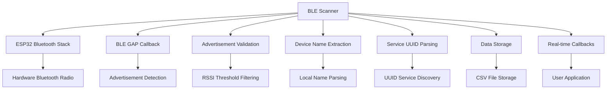

# BLE Scanner Module Documentation

## Overview

The BLE Scanner module provides comprehensive Bluetooth Low Energy (BLE) advertisement capture functionality for the Forestry Research Device. It operates by scanning for BLE advertisements from nearby devices, enabling passive monitoring of Bluetooth-enabled devices in forestry research environments without requiring pairing or connection.

## Features

- **BLE Advertisement Scanning**: Captures BLE advertisements from all nearby devices
- **Real-time Processing**: Immediate callback-based processing of captured advertisements
- **Thread-Safe Operations**: Safe for use in multi-threaded applications
- **Platform Abstraction**: Works on ESP32 (production) and development platforms (mock mode)
- **RSSI Filtering**: Configurable signal strength threshold for filtering weak signals
- **Device Name Extraction**: Automatically extracts device names from advertisement data
- **Service UUID Parsing**: Identifies advertised services (16-bit and 128-bit UUIDs)
- **Comprehensive Logging**: Detailed logging with configurable verbosity levels
- **Data Persistence**: Automatic saving to storage with CSV formatting

## Architecture



## Class Interface

### Constructor
```cpp
BLEScanner(std::shared_ptr<IDataStorage> storage,
           std::shared_ptr<ITimeManager> timeManager);
```

### Core Methods
```cpp
// Initialization and lifecycle
bool initialize();                          // Initialize Bluetooth stack and BLE scanning
bool startScan();                          // Enable BLE advertisement scanning
bool stopScan();                           // Disable BLE advertisement scanning
void cleanup();                            // Clean up resources

// Data access
std::vector<ProbeRequest> getResults();    // Get all captured BLE advertisements
size_t getResultCount() const;             // Get count of captured advertisements
void clearResults();                       // Clear stored results
bool isScanning() const;                   // Check if currently scanning

// Configuration
void setScanParams(uint16_t interval, uint16_t window);  // Configure scan timing
void setResultCallback(std::function<void(const ProbeRequest&)> callback);
void setMinRSSI(int minRssi);              // Set minimum RSSI threshold
ScanConfig getScanConfig() const;          // Get current configuration
```

## Data Structures

### ProbeRequest Structure
```cpp
struct ProbeRequest {
    std::string dataType;        // "BLE"
    std::string timestamp;       // ISO 8601 timestamp
    std::string source;          // "ble"
    int rssi;                   // Signal strength in dBm
    int packetLength;           // Advertisement data length in bytes
    std::string macAddress;     // MAC address (format: "aa:bb:cc:dd:ee:ff")
    std::string payload;        // Hex representation + parsed data
};
```

### ScanConfig Structure
```cpp
struct ScanConfig {
    int minRssi;                // Minimum RSSI threshold
    uint16_t interval;          // Scan interval (BLE time units)
    uint16_t window;            // Scan window (BLE time units)
    bool scanning;              // Current scanning state
};
```

### Example BLE Advertisement Data
```cpp
ProbeRequest {
    .dataType = "BLE",
    .timestamp = "2024-01-15T10:30:45Z",
    .source = "ble",
    .rssi = -52,
    .packetLength = 31,
    .macAddress = "aa:bb:cc:dd:ee:ff",
    .payload = "02 01 06 0a 09 69 50 68 6f 6e 65 20 31 32 [Name: iPhone 12] [Services: 180f,1812]"
}
```

## Usage Examples

### Basic Usage

```cpp
#include "scanners/ble_scanner.h"
#include "data/sdcard_manager.h"
#include "data/rtc_time_manager.h"

int main() {
    // Create dependencies
    auto storage = std::make_shared<SDCardManager>();
    auto timeManager = std::make_shared<RTCTimeManager>();
    
    // Initialize dependencies
    storage->initialize();
    timeManager->initialize();
    
    // Create BLE scanner
    auto bleScanner = std::make_unique<BLEScanner>(storage, timeManager);
    
    // Initialize scanner
    if (!bleScanner->initialize()) {
        LOG_ERROR("Main", "BLE scanner initialization failed");
        return -1;
    }
    
    // Configure scan parameters (optional)
    bleScanner->setScanParams(0x50, 0x30);  // 50ms interval, 30ms window
    bleScanner->setMinRSSI(-80);             // Filter signals weaker than -80 dBm
    
    // Start scanning
    if (!bleScanner->startScan()) {
        LOG_ERROR("Main", "Failed to start BLE scan");
        return -1;
    }
    
    // Scan for 30 seconds
    LOG_INFO("Main", "Scanning for BLE devices for 30 seconds...");
    std::this_thread::sleep_for(std::chrono::seconds(30));
    
    // Stop scanning
    bleScanner->stopScan();
    
    // Get results
    auto results = bleScanner->getResults();
    LOG_INFO("Main", "Captured {} BLE advertisements", results.size());
    
    // Process results
    for (const auto& request : results) {
        LOG_INFO("Main", "BLE Device: {} (RSSI: {} dBm)", 
                request.macAddress, request.rssi);
        
        // Check for device name in payload
        if (request.payload.find("[Name:") != std::string::npos) {
            LOG_INFO("Main", "  Named device detected");
        }
        
        // Check for services
        if (request.payload.find("[Services:") != std::string::npos) {
            LOG_INFO("Main", "  Services advertised");
        }
    }
    
    return 0;
}
```

### Real-time Processing with Device Classification

```cpp
#include "scanners/ble_scanner.h"

void setupRealTimeBLEProcessing() {
    auto bleScanner = std::make_unique<BLEScanner>(storage, timeManager);
    
    // Set up real-time callback for immediate processing
    bleScanner->setResultCallback([](const ProbeRequest& request) {
        // Process BLE advertisement immediately
        LOG_INFO("BLE", "Real-time advertisement: {} (RSSI: {} dBm)", 
                request.macAddress, request.rssi);
        
        // Check for very close devices
        if (request.rssi > -40) {
            LOG_WARNING("BLE", "Very close BLE device detected: {}", request.macAddress);
            handleCloseDevice(request);
        }
        
        // Classify device by MAC address patterns
        DeviceType type = classifyBLEDevice(request.macAddress);
        switch (type) {
            case DeviceType::SMARTPHONE:
                LOG_INFO("BLE", "Smartphone detected: {}", request.macAddress);
                trackSmartphone(request);
                break;
            case DeviceType::FITNESS_TRACKER:
                LOG_INFO("BLE", "Fitness tracker detected: {}", request.macAddress);
                trackFitnessDevice(request);
                break;
            case DeviceType::SMART_WATCH:
                LOG_INFO("BLE", "Smart watch detected: {}", request.macAddress);
                trackSmartWatch(request);
                break;
            default:
                LOG_DEBUG("BLE", "Unknown device type: {}", request.macAddress);
                break;
        }
        
        // Extract and analyze device name
        std::string deviceName = extractDeviceNameFromPayload(request.payload);
        if (!deviceName.empty()) {
            LOG_INFO("BLE", "Device name: '{}' [{}]", deviceName, request.macAddress);
            analyzeDeviceName(deviceName, request);
        }
        
        // Parse advertised services
        auto services = extractServicesFromPayload(request.payload);
        if (!services.empty()) {
            LOG_INFO("BLE", "Services: {} [{}]", joinServices(services), request.macAddress);
            analyzeServices(services, request);
        }
    });
    
    bleScanner->initialize();
    bleScanner->startScan();
    
    // Scanner will now call callback for each BLE advertisement
    LOG_INFO("BLE", "Real-time BLE processing active");
}

enum class DeviceType {
    SMARTPHONE,
    FITNESS_TRACKER,
    SMART_WATCH,
    HEADPHONES,
    UNKNOWN
};

DeviceType classifyBLEDevice(const std::string& mac) {
    // Classify based on MAC address OUI (first 3 bytes)
    std::string oui = mac.substr(0, 8);  // "aa:bb:cc"
    
    // Apple devices
    if (oui == "ac:87:a3" || oui == "f0:18:98" || oui == "34:36:3b") {
        return DeviceType::SMARTPHONE;  // iPhone/iPad
    }
    
    // Samsung devices
    if (oui == "08:96:ad" || oui == "c8:19:f7" || oui == "e4:70:b8") {
        return DeviceType::SMARTPHONE;  // Samsung Galaxy
    }
    
    // Fitbit devices
    if (oui == "fb:03:44" || oui == "c8:0f:10") {
        return DeviceType::FITNESS_TRACKER;
    }
    
    // Apple Watch
    if (oui == "7c:6d:62" || oui == "a4:83:e7") {
        return DeviceType::SMART_WATCH;
    }
    
    return DeviceType::UNKNOWN;
}

void handleCloseDevice(const ProbeRequest& request) {
    LOG_CRITICAL("BLE", "Very close BLE device: {} at {} dBm", 
                request.macAddress, request.rssi);
    
    // Could trigger immediate alert or special logging
    // Store in high-priority database for immediate analysis
}

std::string extractDeviceNameFromPayload(const std::string& payload) {
    size_t nameStart = payload.find("[Name: ");
    if (nameStart != std::string::npos) {
        nameStart += 7;  // Length of "[Name: "
        size_t nameEnd = payload.find("]", nameStart);
        if (nameEnd != std::string::npos) {
            return payload.substr(nameStart, nameEnd - nameStart);
        }
    }
    return "";
}

std::vector<std::string> extractServicesFromPayload(const std::string& payload) {
    std::vector<std::string> services;
    size_t servicesStart = payload.find("[Services: ");
    if (servicesStart != std::string::npos) {
        servicesStart += 11;  // Length of "[Services: "
        size_t servicesEnd = payload.find("]", servicesStart);
        if (servicesEnd != std::string::npos) {
            std::string servicesStr = payload.substr(servicesStart, servicesEnd - servicesStart);
            // Split by comma
            std::stringstream ss(servicesStr);
            std::string service;
            while (std::getline(ss, service, ',')) {
                services.push_back(service);
            }
        }
    }
    return services;
}
```

### Continuous BLE Monitoring with Analytics

```cpp
#include "scanners/ble_scanner.h"
#include <map>
#include <set>

class BLEDeviceTracker {
private:
    std::map<std::string, std::vector<ProbeRequest>> deviceHistory_;
    std::set<std::string> uniqueDevices_;
    std::mutex trackerMutex_;
    
public:
    void addDevice(const ProbeRequest& request) {
        std::lock_guard<std::mutex> lock(trackerMutex_);
        deviceHistory_[request.macAddress].push_back(request);
        uniqueDevices_.insert(request.macAddress);
    }
    
    size_t getUniqueDeviceCount() const {
        std::lock_guard<std::mutex> lock(trackerMutex_);
        return uniqueDevices_.size();
    }
    
    std::vector<std::string> getFrequentDevices(size_t minObservations = 5) const {
        std::lock_guard<std::mutex> lock(trackerMutex_);
        std::vector<std::string> frequent;
        
        for (const auto& [mac, history] : deviceHistory_) {
            if (history.size() >= minObservations) {
                frequent.push_back(mac);
            }
        }
        
        return frequent;
    }
    
    void generateReport() const {
        std::lock_guard<std::mutex> lock(trackerMutex_);
        
        LOG_INFO("BLETracker", "=== BLE Device Analysis Report ===");
        LOG_INFO("BLETracker", "Total unique devices: {}", uniqueDevices_.size());
        
        // Signal strength analysis
        std::map<std::string, int> signalRanges;
        for (const auto& [mac, history] : deviceHistory_) {
            if (!history.empty()) {
                int avgRssi = 0;
                for (const auto& req : history) {
                    avgRssi += req.rssi;
                }
                avgRssi /= history.size();
                
                if (avgRssi > -50) signalRanges["Very Strong (-50 to 0)"]++;
                else if (avgRssi > -70) signalRanges["Strong (-70 to -50)"]++;
                else if (avgRssi > -85) signalRanges["Moderate (-85 to -70)"]++;
                else signalRanges["Weak (< -85)"]++;
            }
        }
        
        for (const auto& [range, count] : signalRanges) {
            LOG_INFO("BLETracker", "{}: {} devices", range, count);
        }
        
        // Most frequently seen devices
        auto frequent = getFrequentDevices(3);
        LOG_INFO("BLETracker", "Frequently seen devices (3+ observations): {}", frequent.size());
        for (const auto& mac : frequent) {
            LOG_INFO("BLETracker", "  {}: {} observations", mac, deviceHistory_.at(mac).size());
        }
    }
};

class ContinuousBLEMonitor {
private:
    std::unique_ptr<BLEScanner> scanner_;
    std::atomic<bool> running_;
    std::thread monitorThread_;
    BLEDeviceTracker tracker_;
    
public:
    ContinuousBLEMonitor(std::shared_ptr<IDataStorage> storage,
                        std::shared_ptr<ITimeManager> timeManager) 
        : scanner_(std::make_unique<BLEScanner>(storage, timeManager))
        , running_(false) {}
    
    bool start() {
        if (!scanner_->initialize()) {
            return false;
        }
        
        // Configure for continuous monitoring
        scanner_->setScanParams(0x50, 0x30);  // Balanced scan parameters
        scanner_->setMinRSSI(-90);             // Capture weak signals too
        
        // Set up device tracking
        scanner_->setResultCallback([this](const ProbeRequest& request) {
            tracker_.addDevice(request);
            
            // Log interesting devices
            if (request.rssi > -50) {
                LOG_INFO("BLEMonitor", "Close device: {} ({})", request.macAddress, request.rssi);
            }
        });
        
        running_.store(true);
        monitorThread_ = std::thread(&ContinuousBLEMonitor::monitorLoop, this);
        
        LOG_INFO("BLEMonitor", "Continuous BLE monitoring started");
        return true;
    }
    
    void stop() {
        running_.store(false);
        if (monitorThread_.joinable()) {
            monitorThread_.join();
        }
        scanner_->cleanup();
        LOG_INFO("BLEMonitor", "Continuous BLE monitoring stopped");
    }
    
    void getStatistics() const {
        tracker_.generateReport();
    }
    
private:
    void monitorLoop() {
        const auto scanDuration = std::chrono::seconds(60);    // 1 minute scans
        const auto pauseDuration = std::chrono::seconds(10);   // 10 second pause
        
        while (running_.load()) {
            // Start scan cycle
            LOG_INFO("BLEMonitor", "Starting BLE scan cycle");
            scanner_->clearResults();
            scanner_->startScan();
            
            // Scan for specified duration
            std::this_thread::sleep_for(scanDuration);
            
            // Stop and analyze results
            scanner_->stopScan();
            auto results = scanner_->getResults();
            
            LOG_INFO("BLEMonitor", "BLE scan cycle complete: {} advertisements captured", 
                    results.size());
            
            // Generate periodic reports
            static int cycleCount = 0;
            if (++cycleCount % 10 == 0) {  // Every 10 cycles
                tracker_.generateReport();
            }
            
            // Pause between scans
            std::this_thread::sleep_for(pauseDuration);
        }
    }
};

// Usage
int main() {
    auto storage = std::make_shared<SDCardManager>();
    auto timeManager = std::make_shared<RTCTimeManager>();
    
    ContinuousBLEMonitor monitor(storage, timeManager);
    
    if (!monitor.start()) {
        LOG_ERROR("Main", "Failed to start BLE monitor");
        return -1;
    }
    
    // Run for 2 hours
    std::this_thread::sleep_for(std::chrono::hours(2));
    
    // Get final statistics
    monitor.getStatistics();
    monitor.stop();
    
    return 0;
}
```

### Integration with Main Application

```cpp
// In main.cpp - integration with system state machine
void ForestryResearchApplication::performScanningCycle() {
    LOG_INFO("ForestryResearchDevice", "Starting scanning cycle");
    
    // Clear previous results
    bleScanner->clearResults();
    
    // Set up real-time processing
    bleScanner->setResultCallback([this](const ProbeRequest& device) {
        stats.totalBLEDevices++;
        LOG_DEBUG("BLEScanner", "Real-time BLE device: {} ({})", 
                 device.macAddress, device.rssi);
        
        // Check for named devices (likely smartphones/tablets)
        if (device.payload.find("[Name:") != std::string::npos) {
            LOG_INFO("BLEScanner", "Named BLE device detected: {}", device.macAddress);
        }
        
        // Check for service advertisements
        if (device.payload.find("[Services:") != std::string::npos) {
            LOG_DEBUG("BLEScanner", "BLE services advertised: {}", device.macAddress);
        }
    });
    
    // Start BLE scan
    LOG_INFO("ForestryResearchDevice", "Starting BLE scan");
    
    auto bleThread = std::thread([this]() {
        try {
            bleScanner->startScan();
            
            // Scan for configured duration
            std::this_thread::sleep_for(scanConfig.bleScanDuration);
            
            bleScanner->stopScan();
        } catch (const std::exception& e) {
            LOG_ERROR("BLEScanner", "BLE scan error: {}", e.what());
        }
    });
    
    // Wait for scan to complete
    if (bleThread.joinable()) bleThread.join();
    
    // Get final results
    auto bleResults = bleScanner->getResults();
    
    LOG_INFO("ForestryResearchDevice", 
            "BLE scanning complete - {} advertisements captured", 
            bleResults.size());
}
```

## BLE Advertisement Data Parsing

### Device Name Extraction
```cpp
// The scanner automatically extracts device names from BLE advertisement data
// Names appear in the payload as: "[Name: iPhone 12]"

std::string extractDeviceName(const std::string& payload) {
    size_t nameStart = payload.find("[Name: ");
    if (nameStart != std::string::npos) {
        nameStart += 7;  // Skip "[Name: "
        size_t nameEnd = payload.find("]", nameStart);
        if (nameEnd != std::string::npos) {
            return payload.substr(nameStart, nameEnd - nameStart);
        }
    }
    return "";
}
```

### Service UUID Extraction
```cpp
// Services appear in the payload as: "[Services: 180f,1812,1234]"
// 16-bit UUIDs are shown as 4 hex digits (e.g., "180f")
// 128-bit UUIDs are shown in full format (e.g., "6e400001-b5a3-f393-e0a9-e50e24dcca9e")

std::vector<std::string> extractServices(const std::string& payload) {
    std::vector<std::string> services;
    size_t start = payload.find("[Services: ");
    if (start != std::string::npos) {
        start += 11;  // Skip "[Services: "
        size_t end = payload.find("]", start);
        if (end != std::string::npos) {
            std::string serviceStr = payload.substr(start, end - start);
            // Split by comma
            std::stringstream ss(serviceStr);
            std::string service;
            while (std::getline(ss, service, ',')) {
                services.push_back(service);
            }
        }
    }
    return services;
}
```

### Common Service UUIDs
```cpp
// Standard BLE service UUIDs you might encounter:
std::map<std::string, std::string> commonServices = {
    {"1800", "Generic Access"},
    {"1801", "Generic Attribute"},
    {"180f", "Battery Service"},
    {"1812", "Human Interface Device"},
    {"180a", "Device Information"},
    {"1805", "Current Time Service"},
    {"181c", "User Data"},
    {"181d", "Weight Scale"},
    {"181e", "Bond Management"},
    {"fe95", "Xiaomi Inc."},
    {"fe9f", "Google"},
    {"004c", "Apple, Inc."}
};
```

## Platform-Specific Implementation

### ESP32 (Production)

```cpp
// Automatically detected via #ifdef ESP32_PLATFORM
// Uses ESP-IDF Bluetooth stack with BLE GAP scanning
// Full Bluedroid stack initialization and management
// Hardware Bluetooth radio integration

// Key ESP32 components initialized:
esp_bt_controller_init(&bt_cfg);
esp_bt_controller_enable(ESP_BT_MODE_BLE);
esp_bluedroid_init();
esp_bluedroid_enable();
esp_ble_gap_register_callback(esp32BleGapCallback);
esp_ble_gap_set_scan_params(&scanParams);
esp_ble_gap_start_scanning(0);  // Continuous until stopped
```

### Development Platforms

```cpp
// Mock implementation for testing
// Simulates realistic BLE devices with various characteristics
// Configurable device patterns and RSSI values
// No hardware dependencies

void simulateBLEDevices() {
    // Creates mock BLE advertisements for testing
    // Includes smartphones, fitness trackers, smart watches
}
```

## Configuration

### Build Configuration

```cmake
# CMakeLists.txt
if(ESP32_PLATFORM)
    # ESP32-specific BLE libraries
    target_link_libraries(ForestryDeviceLib bt)
endif()
```

### Compile-Time Options

```cpp
// Enable debug output
#define DEBUG_BLE_SCAN

// Platform detection
#ifdef ESP32_PLATFORM
    // ESP32 implementation
#else
    // Development mock implementation
#endif
```

### Runtime Configuration

```cpp
// Scan timing parameters (BLE time units = 0.625ms each)
scanner->setScanParams(0x50, 0x30);  // 50ms interval, 30ms window

// RSSI filtering
scanner->setMinRSSI(-80);  // Minimum signal strength

// Configuration in main.h
namespace Config {
    struct ScanConfig {
        std::chrono::seconds bleScanDuration{30};  // Scan duration
        int rssiThreshold = -80;                   // Minimum RSSI
        bool enableRealTimeCallbacks = true;       // Real-time processing
    };
}
```

## Error Handling

### Common Error Scenarios

```cpp
// Bluetooth stack initialization failures
if (!bleScanner->initialize()) {
    LOG_ERROR("Main", "BLE initialization failed - check Bluetooth hardware");
    // Fallback: continue without BLE scanning
}

// Scan start failures
if (!bleScanner->startScan()) {
    LOG_ERROR("Main", "BLE scan start failed - stack may be busy");
    // Retry after delay
    std::this_thread::sleep_for(std::chrono::seconds(2));
    bleScanner->startScan();
}

// Resource cleanup
try {
    bleScanner->cleanup();
} catch (const std::exception& e) {
    LOG_ERROR("Main", "BLE cleanup error: {}", e.what());
    // Continue shutdown process
}
```

### Exception Safety

```cpp
// All methods are exception-safe and use RAII
try {
    auto scanner = std::make_unique<BLEScanner>(storage, timeManager);
    scanner->initialize();
    scanner->startScan();
    
    // Even if exception occurs, destructor will clean up
    
} catch (const std::exception& e) {
    LOG_ERROR("Main", "BLE scanner exception: {}", e.what());
    // Resources automatically cleaned up
}
```

## Performance Considerations

### Memory Usage
- **Static Memory**: ~3KB for class instance
- **Dynamic Memory**: ~150 bytes per captured advertisement
- **Peak Memory**: Depends on scan duration and device density

### CPU Usage
- **BLE Scanning**: ~3-7% CPU usage during active scanning
- **Advertisement Processing**: ~0.5ms per advertisement
- **Storage I/O**: Asynchronous, non-blocking

### Battery Impact (ESP32)
- **Active Scanning**: ~20-30mA additional current
- **Passive Scanning**: ~15-20mA additional current
- **Sleep Mode**: Bluetooth stack can be disabled for deep sleep

### Scan Parameter Optimization
```cpp
// Balanced performance (default)
scanner->setScanParams(0x50, 0x30);  // 50ms interval, 30ms window

// High sensitivity (more power)
scanner->setScanParams(0x20, 0x20);  // 20ms interval, 20ms window

// Power saving (less sensitive)
scanner->setScanParams(0x100, 0x30); // 160ms interval, 30ms window
```

## Troubleshooting

### Common Issues

1. **No BLE Advertisements Captured**
   ```cpp
   // Check Bluetooth initialization
   if (!bleScanner->initialize()) {
       LOG_ERROR("Debug", "Bluetooth stack initialization failed");
   }
   
   // Verify scanning state
   if (!bleScanner->isScanning()) {
       LOG_ERROR("Debug", "Scanner not in active state");
   }
   
   // Check RSSI threshold
   scanner->setMinRSSI(-100);  // Very sensitive
   ```

2. **High Memory Usage**
   ```cpp
   // Clear results periodically
   if (bleScanner->getResultCount() > 500) {
       auto results = bleScanner->getResults();
       // Process and save results
       bleScanner->clearResults();
   }
   ```

3. **ESP32 Bluetooth Stack Crashes**
   ```cpp
   // Ensure proper initialization order
   nvs_flash_init();
   esp_bt_controller_init(&bt_cfg);
   esp_bt_controller_enable(ESP_BT_MODE_BLE);
   esp_bluedroid_init();
   esp_bluedroid_enable();
   // Then initialize BLE scanner
   ```

### Debug Output

```cpp
// Enable detailed logging
Logger::initialize(LogLevel::DEBUG, LogLevel::DEBUG);

// Check scan configuration
auto config = bleScanner->getScanConfig();
LOG_DEBUG("Debug", "RSSI threshold: {}", config.minRssi);
LOG_DEBUG("Debug", "Scan interval: {} ({}ms)", config.interval, config.interval * 0.625);
LOG_DEBUG("Debug", "Scan window: {} ({}ms)", config.window, config.window * 0.625);

// Monitor callback execution
bleScanner->setResultCallback([](const ProbeRequest& request) {
    LOG_DEBUG("Debug", "Callback triggered: {} ({})", request.macAddress, request.rssi);
});
```

## Integration Points

### Storage Integration
```cpp
// Automatic CSV file creation
// Filename format: "timestamp.csv"
// Headers: timestamp,mac_address,device_name,rssi,packet_length,services,payload
```

### Time Management Integration
```cpp
// Uses ITimeManager for timestamps
// Falls back to system time if unavailable
// ISO 8601 format: "2024-01-15T10:30:45Z"
```

### Logging Integration
```cpp
// Component-based logging: "BLEScanner"
// Configurable verbosity levels
// Automatic log rotation and file management
```

## Device Classification

### MAC Address OUI Database
```cpp
// Organizationally Unique Identifiers for common manufacturers
std::map<std::string, std::string> knownOUIs = {
    {"ac:87:a3", "Apple, Inc."},
    {"f0:18:98", "Apple, Inc."},
    {"08:96:ad", "Samsung Electronics"},
    {"c8:19:f7", "Samsung Electronics"},
    {"fb:03:44", "Fitbit, Inc."},
    {"c8:0f:10", "Fitbit, Inc."},
    {"dc:2c:26", "Xiaomi"},
    {"78:11:dc", "Xiaomi"}
};
```

### Device Type Detection
```cpp
enum class BLEDeviceType {
    SMARTPHONE,      // iPhone, Android phones
    TABLET,          // iPad, Android tablets
    FITNESS_TRACKER, // Fitbit, Garmin, etc.
    SMART_WATCH,     // Apple Watch, Wear OS
    HEADPHONES,      // AirPods, Bluetooth headphones
    SMART_HOME,      // IoT devices, beacons
    UNKNOWN
};

BLEDeviceType classifyDevice(const ProbeRequest& request) {
    // Classify based on MAC OUI and advertised services
    std::string oui = request.macAddress.substr(0, 8);
    auto services = extractServicesFromPayload(request.payload);
    
    // Check for common service patterns
    for (const auto& service : services) {
        if (service == "180f") return BLEDeviceType::FITNESS_TRACKER;  // Battery Service
        if (service == "1812") return BLEDeviceType::SMART_WATCH;      // HID Service
    }
    
    // Check MAC address patterns
    if (oui == "ac:87:a3" || oui == "f0:18:98") {
        return BLEDeviceType::SMARTPHONE;  // Apple devices
    }
    
    return BLEDeviceType::UNKNOWN;
}
```

## Future Enhancements

### Planned Features
- **Advertisement Filtering**: Filter by specific service UUIDs or device types
- **Device Tracking**: Track device movement patterns based on RSSI
- **Connection Attempts**: Attempt connections to gather more device information
- **Manufacturer Data Parsing**: Extract and decode manufacturer-specific data

### API Extensions
```cpp
// Future methods
void setServiceFilter(const std::vector<std::string>& serviceUUIDs);
void setDeviceTypeFilter(const std::vector<BLEDeviceType>& types);
std::map<std::string, std::vector<int>> getRSSIHistory();
bool connectToDevice(const std::string& macAddress);
```

## References

- [ESP-IDF Bluetooth API Documentation](https://docs.espressif.com/projects/esp-idf/en/latest/esp32/api-reference/bluetooth/index.html)
- [Bluetooth Core Specification](https://www.bluetooth.com/specifications/bluetooth-core-specification/)
- [BLE Advertisement Data Format](https://www.bluetooth.com/specifications/assigned-numbers/generic-access-profile/)
- [ESP32 Bluetooth Programming Guide](https://docs.espressif.com/projects/esp-idf/en/latest/esp32/api-guides/bluetooth.html)